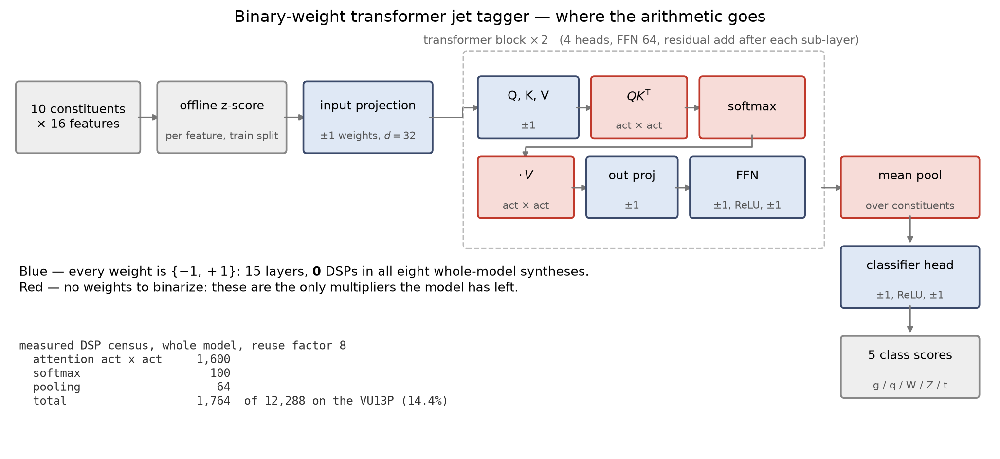
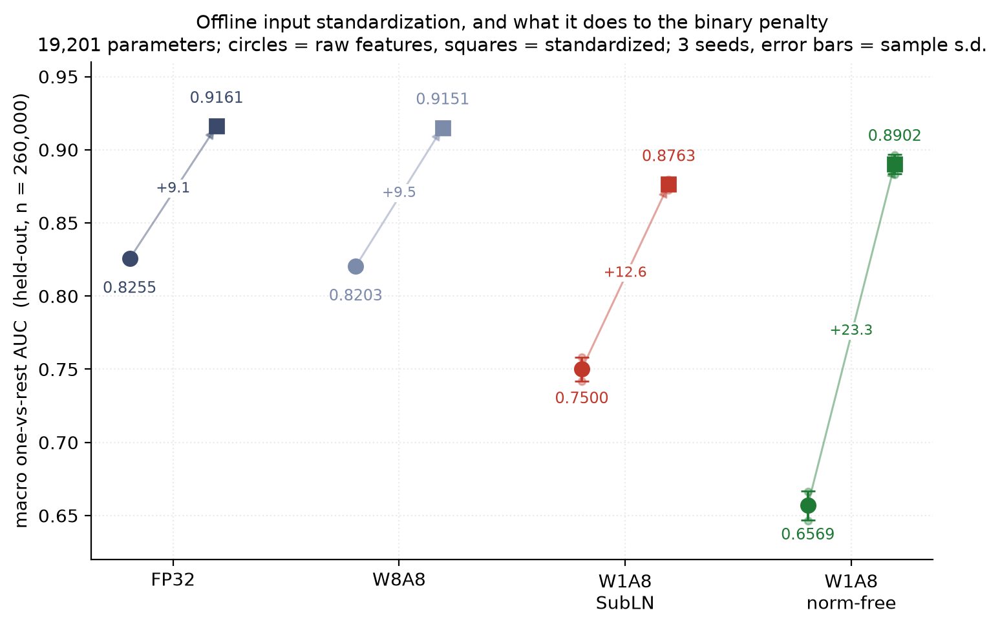
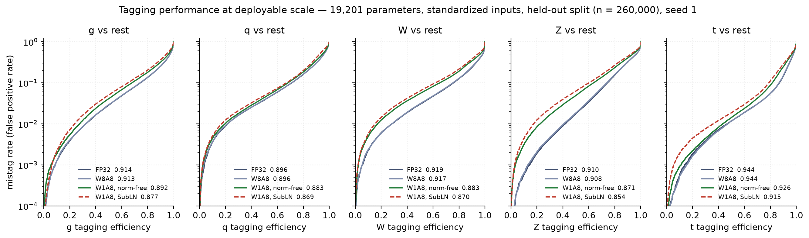
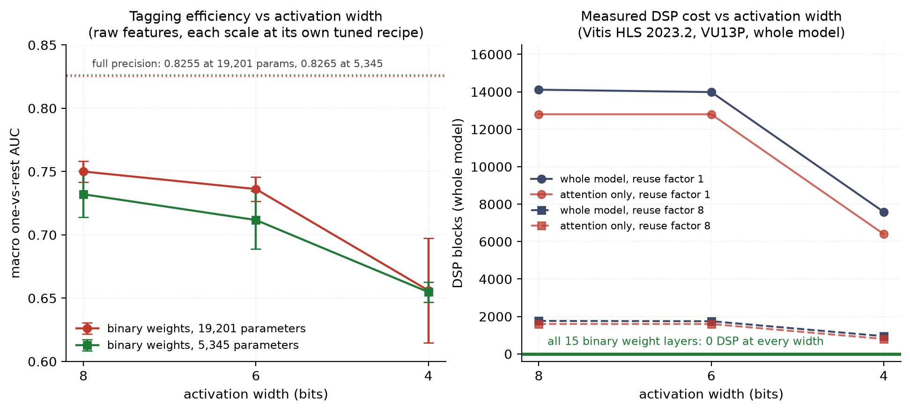
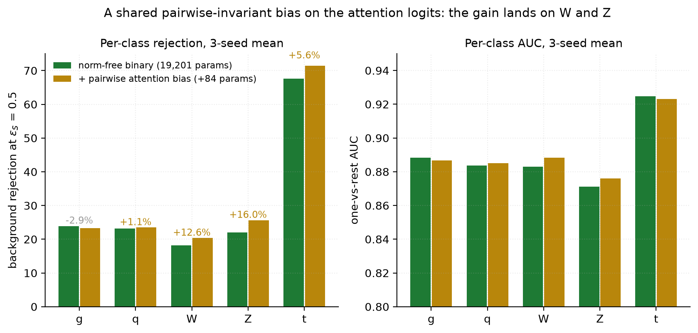
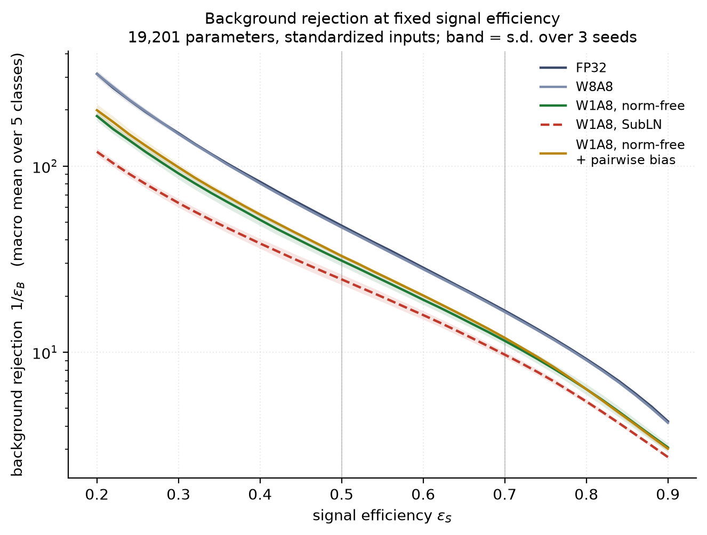
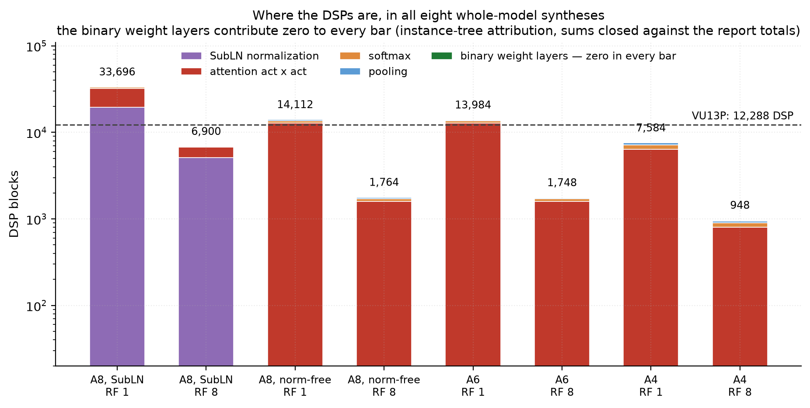
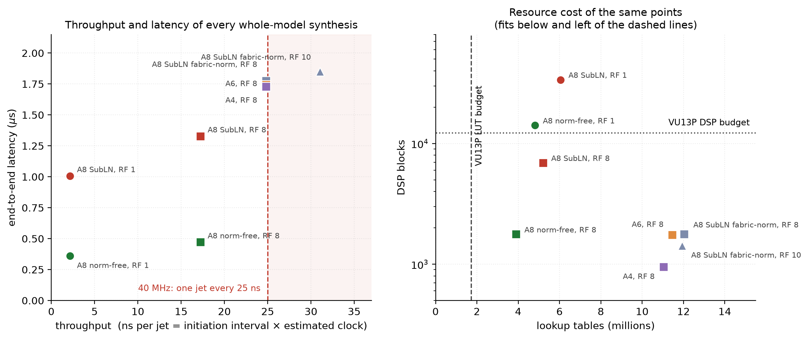
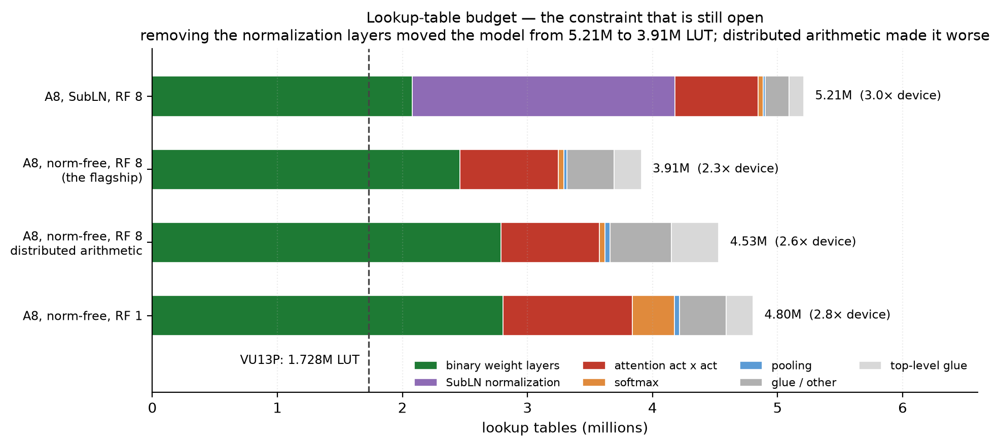

# A binary-weight transformer jet tagger for the CMS Level-1 trigger

Kai Yamaguchi · University of California, San Diego

The Level-1 trigger of a general-purpose LHC experiment accepts a new event every 25 ns and
must reach a keep-or-reject decision within a few microseconds, using FPGAs as the only
compute substrate fast enough for the task. Any network deployed there competes for two
scarce resources: the dedicated DSP multiplier blocks (12,288 on the Xilinx VU13P used
throughout this work) and the general lookup-table fabric (1.728 M LUTs). Multiplication is
the dominant cost of neural-network inference and DSP blocks are the first resource exhausted
when several algorithms share a device.

This work constrains **every** attention and feed-forward weight of a transformer jet tagger
to the binary set {−1, +1} in the manner of BitNet, pushes the trained network through hls4ml
into real Vitis HLS C-synthesis, and asks two questions with measurements rather than
estimates:

1. do the binary matrix multiplications map onto LUT logic instead of DSPs, and
2. what does the constraint cost in tagging efficiency, and how far can the *activations*
   then be quantized before efficiency, resources, or latency degrade?

Both are answered on a model sized for the hardware it claims to run on — 19,201 parameters,
the size class of published FPGA taggers — and on the whole artifact rather than on isolated
layer probes.

**Summary of what is measured here.** Across eight continuous whole-model syntheses at three
activation widths, all fifteen binary weight layers consume **zero DSP blocks**; every
multiplier that remains belongs to the weightless activation×activation products inside
attention, to the softmax tables, or to pooling. The deployable configuration meets the
Level-1 throughput condition (a new jet every 8 cycles ≈ 17.3 ns, inside the 25 ns window) at
an end-to-end latency of 0.47 µs, and runs to 0.36 µs when fully unrolled. The cost of the
binary constraint under matched training and conditioned inputs is 2.6 AUC points, which in
the trigger's own operating metric is a 35 % loss of background rejection. The model does not
yet fit a single VU13P: it needs 3.91 M LUTs against 1.728 M available, and closing that gap
is the open problem.

Everything below is recomputed from the per-jet score arrays and raw synthesis reports stored
in this repository. Section 8 gives the commands.

---

## Contents

1. [The model](#1-the-model)
2. [Data and metrics](#2-data-and-metrics)
3. [Training](#3-training)
4. [Tagging efficiency](#4-tagging-efficiency)
5. [Background rejection at fixed signal efficiency](#5-background-rejection-at-fixed-signal-efficiency)
6. [FPGA implementation](#6-fpga-implementation)
7. [Open problems](#7-open-problems)
8. [Reproducing every number](#8-reproducing-every-number)
9. [Repository layout](#9-repository-layout)
10. [Context and references](#10-context-and-references)

---

## 1. The model

A transformer encoder classifier operating on jet constituents. The ten highest-pT
constituents of each jet enter as 16 features each; a linear projection lifts them to a
32-dimensional embedding; two transformer blocks with four attention heads and a
64-dimensional feed-forward network follow; a mean pool over constituents makes the
representation permutation-invariant; a two-layer head emits five class scores.

Every weight matrix in that description — the input projection, the Q, K, V and output
projections of both blocks, both feed-forward layers of both blocks, and both head layers,
fifteen layers in all — is constrained to {−1, +1}. Weights are binarized by an absmean
quantizer, sign(W − α)·β, and trained through the straight-through estimator against
full-precision shadow weights. Activations are quantized to a fixed width of 8, 6 or 4 bits.
The comparison baselines are the identical architecture at full precision (FP32) and at
conventional 8-bit weights and activations (W8A8).



*Figure 1. Data flow of the tagger, colored by what each operation costs in silicon. Blue
operations carry {−1, +1} weights and use no DSP blocks in any synthesis performed here. Red
operations multiply two activations together and have no weights to binarize; they, the
softmax tables and the pooling accumulator are the entire DSP census of the model.*

Two configurations were trained. The primary one, referred to below by its parameter count,
has d = 32, 4 heads, 2 blocks and FFN width 64: 18,405 architectural parameters, or 19,201
including the trainable activation-grid scales and the positional encoding, and approximately
190 k operations per jet, of which 6.4 k are activation×activation products inside attention.
A smaller configuration (d = 16, 2 heads, 2 blocks, FFN 32; 4,853 architectural and 5,345
total parameters, ≈ 52 k operations per jet) measures the capacity axis.

The networks are trained natively in HGQ2, so each checkpoint *is* the hardware model: the
binary kernels are exactly {−β, +β} with no sign-zeros, and the activation grids are static
per-tensor fixed-point grids whose scales are learned during training at pinned total width.
No separate port or rebuild step stands between the trained network and the firmware.

## 2. Data and metrics

| | |
| --- | --- |
| Dataset | Public HLS4ML LHC Jet dataset, 150-constituent version (Zenodo record 3602260) |
| Task | Five-class jet classification: gluon, light quark, W, Z, top |
| Input | Ten highest-pT constituents × 16 features = 160 values per jet |
| Training monitor | Macro one-vs-rest AUC on a 20 % split of the training set |
| Test set | The dataset's own held-out split, n = 260,000 jets, never seen during training |

The dataset is public and standard, which makes the numbers below directly comparable to
published taggers evaluated on it. Classes are balanced and no reweighting is applied.

Two figures of merit are reported throughout, and never conflated:

- **Macro one-vs-rest AUC** on the held-out split. Quoted as the mean over three training
  seeds with the sample standard deviation of those three values.
- **Background rejection at fixed signal efficiency**, 1/ε_B, computed per class one-vs-rest
  as the reciprocal of the false-positive rate at the threshold where the true-positive rate
  first reaches ε_S, then averaged over the five classes. Spreads on rejection are population
  standard deviations over the three seeds, matching the convention of the verified tables in
  `bnjettag/r7/roc-results/`.

AUC and rejection are both reported because they disagree about how expensive binarization
is, and rejection is the quantity a trigger is actually budgeted against. The same caution
appears in the one published attempt to binarize part of a Particle-Transformer-family
network (arXiv:2508.07431), where AUC parity concealed a 15–17 % rejection loss.

Validation AUC and held-out AUC are different measurements; only held-out numbers appear in
any table below.

## 3. Training

Training runs on the NRP Nautilus Kubernetes cluster; the job specifications are in
`bnjettag/code/jobs/` and the run configurations in `bnjettag/code/hgq2/configs/`. The recipe
is Adam (β₂ = 0.98, weight decay 0.01) with one warm-up epoch and a linear decay over 100,
gradient clipping at 1.0, batch size 256, and early stopping on the validation AUC monitor
with patience 15. Three seeds per configuration.

The peak learning rate does not transfer between model scales, and the direction of the
correction is not monotonic. A probe at the 19,201-parameter scale placed the optimum at
2 × 10⁻⁵, below the value inherited from larger models. The 5,345-parameter configuration then
inherited *that* value and produced binary AUCs near 0.58, which was initially read as a
capacity limit; a twelve-run probe of its own placed its optimum at 1 × 10⁻⁴, five times
higher, and retraining the whole column there moved its binary AUC from 0.5789 to 0.7321
(`bnjettag/r7/roc-results/extension/` and `r7b/`). The apparent capacity cliff was a
artifact of the inherited learning rate. Every number in this document uses each scale's own tuned rate.

## 4. Tagging efficiency

### 4.1 Input conditioning dominates the binary penalty

The first campaign fed raw detector features to the network. Under that condition the binary
constraint appeared to cost 7.6 AUC points at 19,201 parameters. Applying an offline
per-feature z-score computed on the training split alone — the standard practice, with the
constants shipped alongside each checkpoint — changes both the level and the ordering.



*Figure 2. Held-out macro one-vs-rest AUC for four configurations at 19,201 parameters, with
raw features (circles) and with offline-standardized features (squares). Three seeds each;
error bars are the sample standard deviation.*

| Configuration | Raw features | Standardized features |
| --- | --- | --- |
| FP32 | 0.8255 ± 0.0008 | 0.9161 ± 0.0009 |
| W8A8 | 0.8203 ± 0.0019 | 0.9151 ± 0.0009 |
| W1A8, with SubLN normalization | 0.7500 ± 0.0083 | 0.8763 ± 0.0035 |
| W1A8, no normalization layers | 0.6569 ± 0.0099 | **0.8902 ± 0.0067** |

The fair cost of binarizing every weight at this scale is **2.6 AUC points**, not 7.6. The
raw-feature measurement remains valid as measured, but its interpretation was confounded:
8-bit input grids cannot resolve features whose per-feature standard deviation reaches ~118,
and no in-fabric normalization recovers information that input quantization has already
discarded.

Eight-bit quantization stays essentially free under this conditioning, 0.10 points below
full precision.

The best binary configuration is the one with **no normalization layers at all**, 1.4 points
above the normalized binary model. This inverts the raw-feature result, where removing every
normalization layer cost 9.3 points. It matters for hardware because, as Section 6 shows, the
normalization layers were the largest single consumer of both scarce FPGA resources: the
cheapest configuration to build is also the most accurate one, so no accuracy-versus-fit
trade-off has to be made at this point.



*Figure 3. Per-class one-vs-rest ROC curves on the held-out split with standardized inputs,
seed 1. The mistag axis is logarithmic. Top quarks remain the most separable class and
gluons the least, at every precision.*

### 4.2 The activation-width ladder

With weights fixed at one bit, the activation width is the remaining quantization knob. Both
scales degrade gracefully from 8 to 6 bits and then fall away at 4.



*Figure 4. Left: held-out AUC against activation width at both model scales, raw features,
each scale at its own tuned learning rate. Right: measured whole-model DSP consumption at the
same three widths, at two reuse factors, from the raw synthesis reports.*

| Activation width | 19,201 parameters | 5,345 parameters |
| --- | --- | --- |
| A8 | 0.7500 ± 0.0083 | 0.7321 ± 0.0183 |
| A6 | 0.7362 ± 0.0095 | 0.7117 ± 0.0229 |
| A4 | 0.6561 ± 0.0412 | 0.6548 ± 0.0080 |
| FP32 reference | 0.8255 ± 0.0008 | 0.8265 ± 0.0041 |

The 4-bit point at 19,201 parameters is seed-unstable. Extending it from three seeds to six
gives 0.6520 ± 0.0279: the instability is real, but the three-seed spread of ± 0.041
overstated it.

### 4.3 Capacity

Full precision saturates by 5,345 parameters on this dataset — the full-precision AUCs at the
two scales agree within their seed spreads — while the binary variants continue to benefit
from capacity. Binarization costs 7.6 points at 19,201 parameters and 9.4 at 5,345 on raw
features. Eight-bit quantization is close to free at both: 0.52 points below full precision at
19,201 parameters, and 0.14 points above it at 5,345, which is inside the seed spread. Only
the one-bit constraint is capacity-hungry, which is the expected shape of a
bits-for-parameters trade rather than a failure mode.

### 4.4 A pairwise-invariant attention bias

One architectural extension has been measured. A shared bias on the pre-softmax attention
logits, built from three Lorentz-invariant functions of each constituent pair (ΔR², k_T², m²)
in the manner of the Particle Transformer, adds 84 parameters to the 19,201-parameter
norm-free recipe and leaves everything else byte-identical. Held-out AUC moves from
0.8902 ± 0.0067 to 0.8918 ± 0.0026, and background rejection improves at every working point
examined: +7.8 % at ε_S = 0.3, +5.9 % at 0.5, +3.7 % at 0.7.



*Figure 5. Per-class effect of the pairwise-invariant attention bias, three seeds each. The
gain is concentrated on W and Z, the two weakest classes of the baseline.*

The magnitude is small against three seeds, but the sign is uniform across working points and
the seed spread tightens by a factor of roughly 2.5–3 in both metrics. The accuracy case is
established; the hardware case is not, because the pair-feature formation for the 45
constituent pairs has not been synthesized.

## 5. Background rejection at fixed signal efficiency

AUC integrates over the whole ROC curve, including regions no trigger would operate in. The
same stored arrays give the trigger-native quantity directly.



*Figure 6. Background rejection against signal efficiency for the deployable-scale
configurations, macro-averaged over the five classes. Bands are the standard deviation over
three seeds.*

| Configuration (19,201 parameters, standardized inputs) | ε_S = 0.5 | ε_S = 0.7 |
| --- | --- | --- |
| FP32 | 47.8 ± 0.9 | 16.7 ± 0.3 |
| W8A8 | 46.8 ± 0.7 (98 % of FP32) | 16.4 ± 0.2 (98 %) |
| W1A8, no normalization | 31.0 ± 2.0 (65 %) | 11.5 ± 0.6 (69 %) |
| W1A8, with SubLN | 24.6 ± 1.6 (52 %) | 9.7 ± 0.4 (58 %) |
| W1A8, no normalization, + pairwise bias | 32.8 ± 0.8 (69 %) | 11.9 ± 0.2 (71 %) |

The 2.6-point AUC gap of Section 4.1 corresponds to a **35 % loss of background rejection**.
Eight-bit quantization tracks full precision in this metric as well. Reporting AUC alone would
understate the price of the binary constraint, which is why both metrics accompany every
headline number in this document.

## 6. FPGA implementation

Synthesis targets a Xilinx VU13P (xcvu13p-flga2577-2-e; 1,728,000 LUT, 3,456,000 FF, 12,288
DSP, 5,376 BRAM-18K) with a 2.5 ns clock target, using hls4ml 1.3.0 on HGQ2 0.1.9 and Vitis
HLS 2023.2. Every number in this section is parsed from the C-synthesis reports stored under
`bnjettag/r7/results/csynth/`.

### 6.1 Conversion

hls4ml converts each trained checkpoint into a single project with no manual assembly, and the
whole model — both blocks, the attention cores, the head — synthesizes as one Vitis project
with RTL produced in minutes. Two constraints had to be resolved to get there, both recorded
in `bnjettag/results/hgq2/constraints_map.md`:

- Keras `LayerNormalization` has no working path through this stack, and its stock kernel's
  inverse-square-root table covers only variances below one. The parameter-free SubLN
  normalization was therefore added as a custom hls4ml layer: new IR layer, precision
  propagation hooks, Vitis templates, and a range-reduced inverse-square-root kernel valid for
  any input variance.
- hls4ml parses `keras.layers.ReLU` with an unsigned, wrapping output precision. Fed by the
  wide accumulator of a binary contraction, its negative inputs wrap to ~2¹⁰ instead of
  clamping to zero, which drove whole-model C-simulation correlation to −0.06 before it was
  found. Setting saturation rather than wrapping on relu-family outputs restores agreement.
  The general rule — any ReLU fed by a wide binary or integer accumulator needs saturating
  output arithmetic — is recorded for reuse.

### 6.2 The DSP census

Resources are attributed per consumer by walking the instance tree of the synthesis report and
subtracting each module's children from its own totals, so that no resource is double-counted.
The attribution closes exactly against the report's own profile total on every file.



*Figure 7. DSP consumption by consumer across all eight whole-model syntheses. The binary
weight layers contribute nothing to any bar.*

| Consumer | A8, RF 1 | A8, RF 8 | A6, RF 1 | A6, RF 8 | A4, RF 1 | A4, RF 8 |
| --- | --- | --- | --- | --- | --- | --- |
| Binary weight multiplies (15 layers) | **0** | **0** | **0** | **0** | **0** | **0** |
| Attention activation×activation | 12,800 | 1,600 | 12,800 | 1,600 | 6,400 | 800 |
| Softmax tables | 800 | 100 | 800 | 100 | 800 | 100 |
| Global pooling | 512 | 64 | 384 | 48 | 384 | 48 |
| Whole model | 14,112 | 1,764 | 13,984 | 1,748 | 7,584 | 948 |

The central claim of this work holds on the complete artifact, at every activation width
tested: **not one DSP block is spent on a binary weight multiplication.** The DSP census is
entirely weightless operations. Where normalization layers are present they dominate it — the
SubLN instances alone account for 19,584 of the 33,696 DSPs of the normalized model at full
unroll — which is a further reason the norm-free configuration of Section 4.1 is the
deployable one.

The single genuine resource-versus-precision effect is that attention DSPs halve at 4-bit
activations, where two multiply-accumulates pack into one DSP48. From 8 to 6 bits the DSP
count is flat. At 4 bits and reuse factor 8 the complete transformer costs 948 DSP blocks,
7.7 % of the device.

### 6.3 Latency and throughput



*Figure 8. Every whole-model synthesis, placed by throughput and latency (left) and by
resource cost (right). A design is deployable when it lies left of 25 ns in the left panel and
below and left of both dashed budgets in the right panel.*

| Emission (19,201 parameters) | DSP | LUT | Latency | II | Est. clock | Per jet |
| --- | --- | --- | --- | --- | --- | --- |
| A8, SubLN, RF 1 | 33,696 | 6.04 M | 466 cyc = 1.005 µs | 1 | 2.157 ns | 2.2 ns |
| A8, SubLN, RF 8 | 6,900 | 5.21 M | 615 cyc = 1.327 µs | 8 | 2.157 ns | 17.3 ns |
| **A8, norm-free, RF 1** | 14,112 | 4.80 M | **167 cyc = 0.360 µs** | 1 | 2.157 ns | 2.2 ns |
| **A8, norm-free, RF 8** | **1,764** | 3.91 M | **218 cyc = 0.470 µs** | 8 | 2.157 ns | 17.3 ns |
| A6, RF 8 | 1,748 | 11.47 M † | 561 cyc = 1.741 µs | 8 | 3.103 ns | 24.8 ns |
| A4, RF 8 | 948 | 11.04 M † | 557 cyc = 1.728 µs | 8 | 3.103 ns | 24.8 ns |

† The A6 and A4 emissions inherited a fabric-bound normalization kernel whose LUT cost is
inflated by roughly 8.9 M and whose achieved clock is degraded; their LUT and clock columns
are not comparable with the canonical 8-bit rows. Their DSP columns are unaffected.

Reuse factor 8 is the Level-1 throughput point: an initiation interval of 8 cycles at the
estimated 2.157 ns clock accepts a new jet every 17.3 ns, inside the 25 ns bunch-crossing
window. The norm-free model reaches it at 0.47 µs end to end, and 0.36 µs when fully
unrolled — sub-microsecond at both operating points, because the normalization layers had been
two thirds of the pipeline depth.

### 6.4 Lookup tables: the constraint that is still open



*Figure 9. Lookup-table consumption by consumer, against the device budget. The dashed line is
the whole VU13P.*

| Consumer, norm-free at RF 8 | LUT | Share |
| --- | --- | --- |
| Binary weight layers | 2,458,704 | 62.9 % |
| Attention activation×activation | 789,076 | 20.2 % |
| Glue and buffers | 374,675 | 9.6 % |
| Top-level glue | 218,825 | 5.6 % |
| Softmax | 42,190 | 1.1 % |
| Pooling | 27,045 | 0.7 % |
| Total | 3,910,515 | 226 % of the device |

The model does not fit. Removing the normalization layers took it from 5.21 M to 3.91 M LUT
and removed their 2.10 M-LUT share, but the remaining overhang belongs to the binary dense
layers themselves, which are 63 % of the budget. Everything the model is *not* spending on
those layers — 1.45 M LUT — would already fit, so a fit is arithmetically reachable if the
binary layers can be built more cheaply.

At the same operating point the other resources are comfortable: 1,764 of 12,288 DSP (14 %),
1.92 M of 3.46 M FF (56 %), and 90 of 5,376 BRAM-18K (1.7 %).

### 6.5 Measured negative results

Five candidate remedies were tested and did not work. Each is recorded with its evidence,
because each one closes off a direction.

**Distributed arithmetic makes it worse.** `Strategy=distributed_arithmetic` (da4ml 0.5.2)
applied to all fifteen binary layers inflated the whole model from 3.91 M to 4.53 M LUT
(+15.8 %) and multiplied flip-flops by 3.70, from 1.92 M to 7.10 M. The mechanism is
structural rather than a tuning failure: the canonical signed-digit representation of a ±1
weight is a single digit, so common-subexpression elimination across weights has nothing to
share. Binary weights are the one case distributed arithmetic cannot help.

**Global reuse folding is exhausted.** Raising the reuse factor from 8 to 10 moved the whole
model from 12.04 M to 11.94 M LUT, and the binary dense layers from 2,077,082 to 2,077,382
LUT — identical to within 0.02 %. With weights inlined as constants, the "multipliers" are
already logic, so reuse converts them into operand-selection multiplexers of the same order.
Reuse folds the wrong axis for a binary core. It also fails the throughput condition:
10 cycles at 3.103 ns is 31 ns, outside the 25 ns window.

**Trading DSPs for fabric in the normalization kernel is anti-fit.** Binding the SubLN
variance multiplies to fabric instead of DSP48s does reach the DSP-free end state — the census
becomes exactly attention plus softmax plus pooling — but normalization LUT rises from 2.10 M
to about 8.9 M and the estimated clock degrades from 2.157 to 3.103 ns. This route was
abandoned in favor of removing the normalization layers entirely, which Section 4.1 shows is
also the more accurate model.

**Streamed I/O is unavailable in this stack.** hls4ml 1.3.0 raises
`NotImplementedError: Heterogenous quantization for activations is only supported with
IOType=io_parallel` before code generation
(`backends/fpga/passes/hgq_proxy_model.py:63`). Streaming would require a frontend change, not
a configuration change.

**Widening the accumulators backfires.** A wide-accumulator emission was tried as a way to
push binary layers off DSPs. It had nothing to fix — they were never on DSPs at this
strategy — and it doubled each attention einsum from 3,200 to 6,400 DSPs by crossing the
DSP48 operand-width boundary, taking the whole model at full unroll from 33,696 to 46,496
blocks. Narrow emission is canonical
(`whole_model_rf{1,8,16}_wide.xml.gz` against `whole_model_rf{1,8}.xml.gz`).

### 6.6 Export fidelity

The correlation between the exported hardware model and the trained checkpoint is measured and
stored per article rather than assumed. At 8 bits the norm-free flagship reaches 0.989 against
its trained forward pass, a ceiling set by the two-signed-digit representation of the residual
scale constants; the 6-bit and 4-bit exports reach 0.953 and 0.883, where the static-grid
substitution at small model scale costs more. The subsequent gate — compiled firmware against
the exported model — passes everywhere, and the norm-free flagship is bit-exact through it. At
the earlier raw-feature operating point the exported hardware model scored 0.7569 on the
held-out split against 0.7582 for the checkpoint it was exported from — a cost of about
0.001 AUC, negligible in physics units at this scale (`bnjettag/r7/README.md`).

## 7. Open problems

1. **Device fit.** 3.91 M LUT against 1.728 M available, 63 % of it in the binary dense
   layers. Section 6.5 closes off reuse folding, distributed arithmetic, and streamed I/O. The
   directions that remain measured-open are folding along the constituent axis rather than the
   reuse axis, and moving the ±1 weights into block RAM.
2. **Whether a 5-bit activation width softens the 6-to-4-bit cliff.** Untested; the ladder has
   only ever been measured at 8, 6 and 4.
3. **The input-size axis.** All results use the ten highest-pT constituents. How accuracy,
   latency and resources move as that count varies has been deferred by design, and the knob
   exists in the code.
4. **The hardware cost of the pairwise attention bias.** The 45-pair feature formation of
   Section 4.4 has not been synthesized, so its accuracy gain currently has no price attached.
5. **Seed count.** Three seeds per configuration is enough to separate the ladder steps and
   the binary penalty, but not to resolve differences of a few tenths of a point, such as the
   pairwise-bias result.

## 8. Reproducing every number

No number here needs to be taken on trust. Every accuracy figure comes from a stored array of
per-jet scores, and every hardware figure from a stored synthesis report.

Accuracy, in about a minute:

```bash
pip install numpy scikit-learn
python3 - <<'PY'
import numpy as np
from sklearn.metrics import roc_auc_score
d = np.load("bnjettag/r7/roc-results/r8/SMALL-W1A8-r8stdnn-s1.npz")   # keys: y, score, meta
print(d["meta"])                                                      # provenance string
print(roc_auc_score(d["y"], d["score"], multi_class="ovr", average="macro"))
PY
```

Each store carries a claim table beside its arrays — `roc_auc.md`, `roc_auc_r8.md`,
`roc_auc_extension.md` — stating what the arrays are asserted to give, so a recomputation can
be checked against a written claim rather than against a number in prose.

Hardware, straight from the reports (they are 40 MB each uncompressed, so they are stored
gzipped):

```bash
gunzip -c bnjettag/r7/results/csynth/whole_model_rf8_stdnn.xml.gz | head -60
gunzip -c bnjettag/r7/results/csynth/whole_model_rf8_stdnn.xml.gz > /tmp/report.xml
python bnjettag/code/hls/parse_census.py /tmp/report.xml DSP     # or LUT
```

Every figure in this document:

```bash
pip install numpy scikit-learn matplotlib
python figures/make_figures.py
```

The script reads the same arrays and reports, writes the nine figures, and writes
`figures/NUMBERS.txt` listing every value that reached a figure, so a plot can be audited
without rerunning it.

## 9. Repository layout

| Path | Contents |
| --- | --- |
| `figures/` | The nine figures of this document, the script that generates them from the stored data, and the value log it emits. |
| `bnjettag/code/hgq2/` | The current pipeline: quantization-aware training, conversion to hls4ml, the custom SubLN layer and its Vitis templates, verification gates, synthesis drivers, run configurations. |
| `bnjettag/code/training/` | The earlier QKeras trainer and ROC tooling. |
| `bnjettag/code/hls/` | Synthesis drivers and the instance-tree report parser used for every census in Section 6. |
| `bnjettag/code/jobs/` | 182 Kubernetes job specifications — every training and synthesis run that produced the results here. |
| `bnjettag/r7/roc-results/` | Per-jet score arrays for the raw-feature campaign, with the verified AUC tables. |
| `bnjettag/r7/roc-results/r7b/` | The 5,345-parameter column, retrained at its own learning rate. |
| `bnjettag/r7/roc-results/r8/` | The standardized-input campaign — the arrays behind Sections 4.1 and 5. |
| `bnjettag/r7/roc-results/extension/` | Seed extensions, the learning-rate probe, and the normalization ablation. |
| `bnjettag/roc-results/r10/` | Arrays for the pairwise attention bias of Section 4.4. |
| `bnjettag/r7/results/csynth/` | Sixteen raw Vitis C-synthesis reports, gzipped. Every hardware number traces here. |
| `bnjettag/r7/results/` | The operating-point study, the LUT census, and the activation-ladder table. |
| `bnjettag/r7/results/convert/` | Conversion and C-simulation evidence per emission: precision maps, fidelity gates, layer inventories. |
| `bnjettag/r7/models/` | Four trained checkpoints, including the norm-free flagship and the standardization constants it expects. |
| `bnjettag/results/hgq2/constraints_map.md` | What converts cleanly through HGQ2 and hls4ml, what needs a custom layer, and where DSPs hide. Established by execution, not by reading documentation. |
| `infrastructure/` | Cluster and synthesis-machine setup. |

Not included: the training dataset (public, Zenodo record 3602260), generated HLS project
bundles and firmware trees (regenerable from the checkpoints and configurations in minutes),
and vendored Xilinx headers.

## 10. Context and references

- **BitNet**, arXiv:2310.11453 — the 1-bit transformer training method adapted here; the
  ternary follow-up is arXiv:2402.17764 and the low-bit-activation study arXiv:2411.04965.
- **hls4ml**, arXiv:1804.06913 — the codesign tool and the trigger-ML programme it anchors.
- **HLS4ML LHC Jet dataset**, arXiv:1804.06913 and arXiv:1908.05318, Zenodo 3602260 — the
  public benchmark used throughout.
- **Sub-microsecond transformers for jet tagging on FPGAs**, arXiv:2510.24784 — the closest
  published system: near-full-precision transformers through hls4ml into Level-1 latency. The
  differentiator of this work is the one-bit weight core and its DSP-free mapping.
- **Ultrafast jet classification at the HL-LHC**, arXiv:2402.01876 — a synthesized tagger in
  the same parameter class (20 k–27 k) on the same device, at 2.1 % DSP and 7–9 % LUT.
- **BitParT**, arXiv:2508.07431 — the only published attempt to binarize part of a
  Particle-Transformer-family network. It leaves attention, normalization and the interaction
  pathway in full precision, reports no hardware numbers, and finds a 15–17 % rejection loss
  behind unchanged AUC.
- **Particle Transformer**, arXiv:2202.03772 — the source of the pairwise-invariant attention
  bias of Section 4.4.
- **da4ml**, arXiv:2507.04535 — the distributed-arithmetic backend evaluated in Section 6.5.
- **EBOPs / HGQ**, arXiv:2405.00645 — the synthesis-free hardware cost metric used during
  design.
